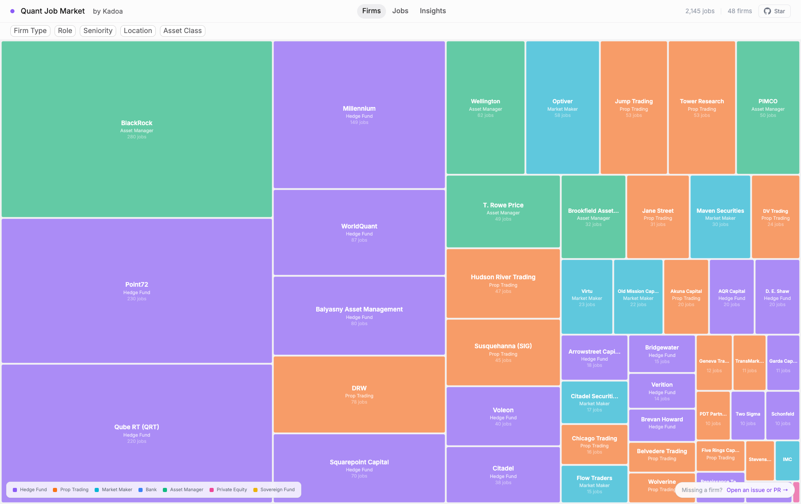

# Quant Job Market

**Live demo: [quant.kadoa.com](https://quant.kadoa.com/)**



Interactive visualization and open dataset of job postings of all major quantitative finance firms.

For each firm we scrape their careers page and extract interesting data like role category, seniority level, programming languages, skills, asset classes, education requirements, and work mode.

## What's in the data?

- **2,500+ quant-relevant job postings from 50+ firms** from hedge funds, prop trading firms, market makers, and asset managers
- Role classification: quant research, quant trading, quant dev, HFT systems, ML/AI, data science, software engineering, risk, portfolio management
- Tech stack extraction: programming languages, etc.
- Seniority, education requirements (PhD demand), asset classes, locations

## Quick start

```bash
bun install && bun run dev
```

Open [http://localhost:5181](http://localhost:5181)

## Features

- **Treemap** of firms sized by quant job count, colored by firm type
- **Filterable** by firm type, role, seniority, location, work mode, and asset class
- **Jobs table** with search, sort, and CSV export
- **Insights dashboard**: tech stack by firm type, PhD demand by firm, top languages, role distribution, locations, seniority, asset classes, education requirements

## Data

The dataset is stored as a SQLite database (`public/data/jobs.db`) and loaded client-side using [sql.js](https://sql.js.org/) (SQLite compiled to WASM). No backend required. A JSON export (`public/data/jobs.json`) is also available for direct use with pandas, R, etc.

| File | Description |
|------|-------------|
| `public/data/jobs.db` | SQLite database with all classified jobs |
| `public/data/jobs.json` | JSON export of all classified job postings |

## Data sources

All data is scraped from publicly available company career pages.
We use [kadoa.com](https://kadoa.com) to source the data and classify each posting. Free trial available if you need it for your own research.

## Missing a firm?

[Open an issue](https://github.com/kadoa-org/quant-job-market/issues) with the firm name and careers page URL, or submit a PR. We'll add it to the next data refresh.

## What's next

- Historical tracking: posting velocity, time-to-removal, seasonal patterns
- Expand firm coverage
- Salary normalization (CoL-adjusted, base vs total comp)
- Skill co-occurrence analysis

## License

MIT -- see [LICENSE](LICENSE).

Job posting data is sourced from public career pages and provided for research and educational purposes.
