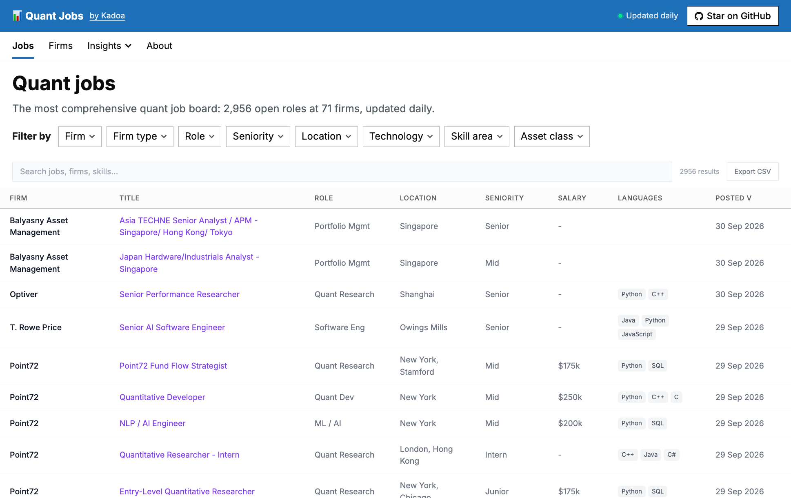

# Quant Jobs

**Live: [kadoa.com/quant](https://www.kadoa.com/quant)**

[](https://www.kadoa.com/quant)

The most comprehensive quant job board. Every open quant role at 70+ hedge funds, prop trading firms, market makers and asset managers, collected daily from their careers pages.

## What is in it

- Around 3,000 open quant roles: research, trading, development, HFT, machine learning and data science
- Each role tagged with seniority, location, salary where posted, programming languages, tools and asset classes
- A page for every firm, role type, location and technology, plus salaries and tech stack heatmaps
- The full dataset as SQLite and JSON, free to download

## Data

**Sources.** Public careers pages of the firms on the board.

**Pipeline.** A [Kadoa](https://www.kadoa.com) pipeline collects the postings every day and classifies each one. The dataset is in `public/data/` as `jobs.db` (SQLite) and `jobs.json`.

## Run it locally

```sh
bun install
bun run dev   # http://localhost:5181/quant/
```

React and Vite. The board queries the SQLite file in the browser with [sql.js](https://sql.js.org/). No backend.

## Missing a firm?

[Open an issue](https://github.com/kadoa-org/quant-jobs/issues) with the firm's name and careers page.

MIT licensed. Built by [Kadoa](https://www.kadoa.com). Job postings are from public careers pages and provided for research.
